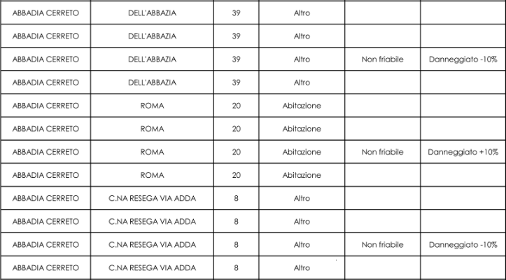

# Introduzione

Questo è un insieme di dati pubblicati nel contesto del progetto "[**Liberiamoli tutti!**](https://datibenecomune.substack.com/about)", e in particolare nel "**numero 1**" della newsletter di progetto.

## Dati

Le [Legge Regionale n° 17 del 2003](https://normelombardia.consiglio.regione.lombardia.it/NormeLombardia/Accessibile/main.aspx?exp_coll=lr002003092900017&view=showdoc&iddoc=lr002003092900017&selnode=lr002003092900017) della **Regione Lombardia** prevede la creazione del "**Registro** **pubblico** degli **edifici** industriali e ad uso abitativo con **presenza** di **amianto**". Questo registro, istituito presso ogni ASL competente per territorio, contiene l'elenco di tutti gli edifici e siti contenenti amianto, con informazioni sul luogo di presenza, il relativo stato di conservazione e il quantitativo presunto. 

Per il territorio dell'Agenzia di Tutela della Salute (ATS) della Città Metropolitana di Milano (province di Milano e Lodi) sono informazioni pubblicate nella sezione ["Amianto negli ambienti di vita](https://www.ats-milano.it/ats/carta-servizi/guida-servizi/ambiente/amianto/amianto-ambienti-vita)". 
Al momento (10 dicembre 2023) i dati sono pubblicati in [questo file PDF](https://www.ats-milano.it/sites/default/files/2023-11/Registro%20Pubblico%20LR17-2003_dal%202012%20al%202022.pdf)

Li abbiamo estratti dal PDF e ripubblicati in [formato `CSV`](https://raw.githubusercontent.com/ondata/liberiamoli-tutti/main/amianto_ats_milano/dati/notifiche_amianto_2012-2022.csv), con separatore `,` e con codifica `UTF-8`.

👉 **Nota Bene**: questi sono rilasciati con **licenza** [**CC-BY 4.0**](https://creativecommons.org/licenses/by/4.0/deed.it): li **puoi usare liberamente**, anche per scopi commerciali, ma devi **citare la fonte**, scrivendo semplicemente "Fonte: [Liberiamoli tutti!](https://datibenecomune.substack.com/)" e inserendo il link ipertestuale a `https://datibenecomune.substack.com/`.

### Registro pubblico degli edifici industriali ed ad uso abitativo con presenza di amianto - Anni dal 2012 al 2022

Si tratta dell'elenco dei luoghi elencati nel registro, con le informazioni su Comune, indirizzo, destinazione d'uso, condizione del materiale, stato di conservazione, tipo di supporto, superficie esposta e quantità di amianto presente.

Gli **anni** di riferimento sono quelli dal **2012** al **2022**.

Il file è [`notifiche_amianto_2012-2022.csv`](https://raw.githubusercontent.com/ondata/liberiamoli-tutti/main/amianto_ats_milano/dati/notifiche_amianto_2012-2022.csv), ed è composto dalle colonne descritte a seguire.

| Nome colonna | Tipologia colonna | Descrizione colonna |
| --- | --- | --- |
| localita_struttura_luogo | string | Nome del comune in cui si trova l'edificio |
| indirizzo_struttura_luogo | string | Indirizzo dell'edificio |
| civico_struttura_luogo | string | Numero civico dell'edificio |
| destinazione_d_uso | string | Destinazione d'uso dell'edificio |
| tipologia_materiale | string | Se il materiale contenente amianto è friabile o no |
| stato_conservazione | string | Lo stato di conservazione |
| tipo_supporto | string | Tipo di supporto del materiale contenente amianto |
| superficie_esposta | number | Superficie esposta in metri quadrati |
| quantita_kg | number | Quantità in chilogrammi |
| quantita_m2 | number | Quantità in metri quadrati |
| quantita_m3 | number | Quantità in metri cubi |
| pagina | integer | Pagina del PDF da cui sono stati estratti i dati |
| comune_nome_attuale | string | Il nome Comune attuale (alcuni Comuni hanno cambiato nome). È un'informazione non presente nel report, che abbiamo aggiunto per rendere i dati più "usabili" |
| comune_istat | string | I codice Istat attuale del Comune. È un'informazione non presente nel report, che abbiamo aggiunto per rendere i dati più "usabili" |

## Note

Questi dati dovrebbero essere pubblicati anche in formati "leggibile meccanicamente", come CSV o JSON, e non solo in PDF. Lo prevedono le norme e linee guida italiane sui dati della Pubblica Amministrazione. Tra questi l'[articolo 6](https://www.normattiva.it/uri-res/N2Ls?urn:nir:stato:decreto.legislativo:2006-01-24;36!vig~art6) del Decreto Legislativo 24 gennaio 2006, n. 36, che rimanda a sua volta all'[articolo 2](https://www.normattiva.it/uri-res/N2Ls?urn:nir:stato:decreto.legislativo:2006-01-24;36!vig~art2), che stabilisce che gli enti pubblici devono utilizzare formati di dati che favoriscano la loro riutilizzazione, che siano appunto in formato leggibile meccanicamente

Il [file PDF](https://www.ats-milano.it/sites/default/files/2023-11/Registro%20Pubblico%20LR17-2003_dal%202012%20al%202022.pdf) di origine è composto da circa 4.000 pagine e 100.000 righe, per 10 anni di dati (dal 2012 al 2022), ma tra le colonne non ce ne è una con la data dell'osservazione. 
È quindi purtroppo impossibile fare un'analisi temporale, valutare emergenze, fare correlazioni con altri eventi, monitorare gli interventi di bonifica.

A ogni Comune andrebbe associato anche il codice Istat di ciascuno, per consentire la correlazione immediata con altri dati. Non era presente nel report, ma lo abbiamo aggiunto noi.

Per la grandissima parte dei dati, emerge una possibile struttura di righe a gruppi di 4 righe (vedi immaginie a seguire). Come se una singola osservazione, fosse composta da 4 righe.
Purtroppo non è documentata e non è costante lungo le 4.000 pagine.

### Tipologia dati

La colonna `Tipologia dati` indica il tipo di dato presente nella colonna. I tipi di dato sono:

- `date`: Questo tipo di campo è utilizzato per contenere date e/o orari. Nel contesto di questo dati si tratte di date in formato anno-mese-giorno (YYYY-MM-DD), come ad esempio `2020-01-18`;
- `number`: Il campo contiene numeri di qualsiasi tipo, compresi i decimali;
- `string`: Questo tipo di campo è utilizzato per testo o combinazioni di caratteri. Può contenere lettere, numeri e simboli.
